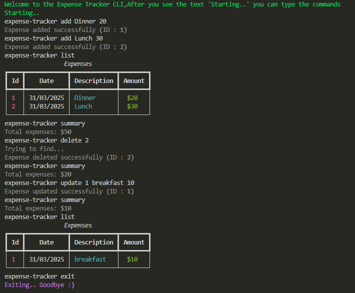

# Expense Tracker CLI




Simple solution for [expense-tracker-cli](https://roadmap.sh/projects/expense-tracker) project from [roadmap.sh](https://roadmap.sh)

App was made with the ```cmd``` module

For more information about the ```cmd``` module, check the https://docs.python.org/3/library/cmd.html

```rich``` module used for make Expense Table and colorful prints  

For more information about the ```rich``` module, check the https://rich.readthedocs.io/en/stable/introduction.html

## How To Run

- Clone the repository
```

  git clone https://github.com/brkcvlk/expense-tracker-cli.git

```
- Create a Virtual Environment
```

    python -m venv venv

```

- Activate the Virtual Environment
```

    venv\Scripts\activate

```
- Install Requirements
```

    pip install -r requirements.txt

```
- Run the Code
```

    python expense-tracker.py

```

## Commands

- ```add <str:description> <int:amount>``` - Add an expense with description and amount
- ```delete <int:id>``` - Delete an expense with id
- ```update <int:id> <str:description> <int:amount>``` - Update an expense with id, description and amount
- ```list <optional:int:month>``` - View all expenses (use month to view specific month list)
- ```summary <optional:int:month>``` - View a summary of all expenses (use month to view specific month summary)
